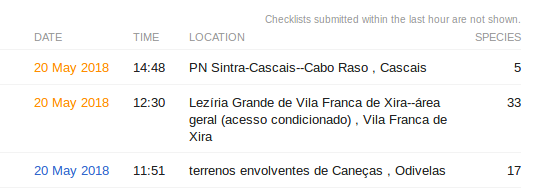
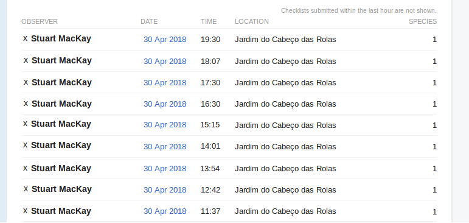
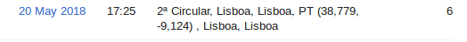
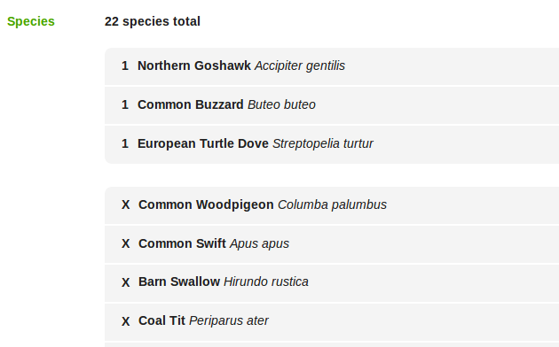
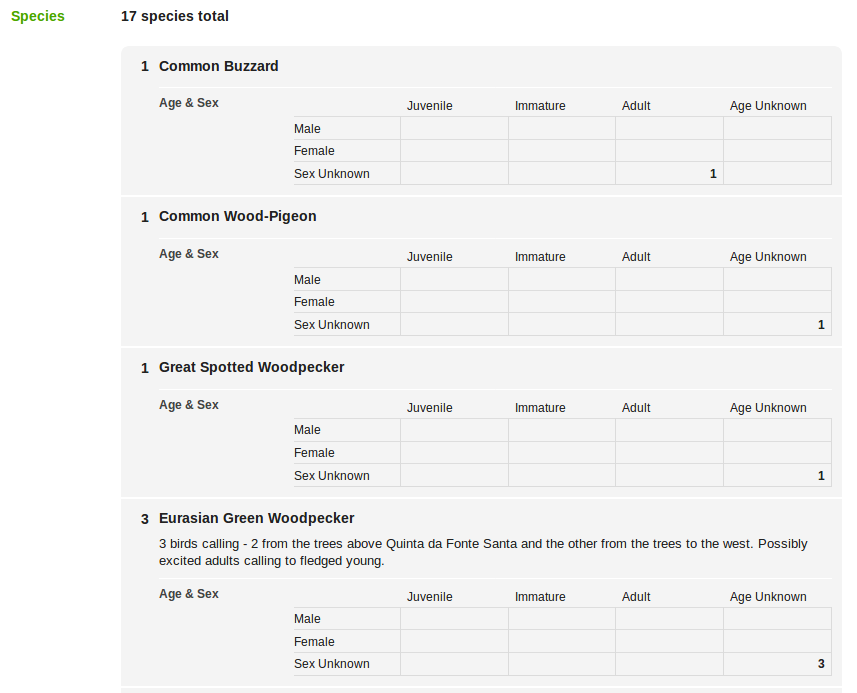
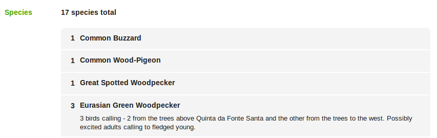

# eBird Superscripts

This is a collection of user scripts that can be used with the 
[greasemonkey](https://www.greasespot.net/) browser addon for Firefox, 
Chrome, etc., to make the web pages on eBird "better". 

## The scripts

The scripts performs various tweaks to a pages displaying the checklist
for a location or the list of visits to a location or region. The goal
is to make it easier to scan through the lists to see what's been seen.

### Recent Visits

For the Recent Visits page for a location or region, e.g.
[Lisboa, Portugal](https://ebird.org/region/PT-11/activity?yr=all&m=) there
are several scripts designed to reduce clutter and make it easy to go through
all the checklists to find out what people have seen.

#### recent_visits_restore_visited.user.js
The stylesheet used by eBird uses the same colour for visited links as links 
you have not followed yet. That makes it impossible to remember which checklists
you've read (unless you write them down). Since it takes a couple of days for 
all the checklists to get published you cannot easily use the Recent Visits 
page to keep track of what's been reported in a given region. 

This script fixes the problem by changing the styles so that visited links 
are coloured dark orange:

#### recent_visits_blacklist.user.js 
This script is arguably the most fun to use. There is some guy called Stuart 
MacKay ;) who loves Feral Pigeons. Every day he submits a checklist for every 
pigeon he sees. This makes the recent visits page for every site he visits and
the entire region completely unusable.

This script neatly solves the problem. It displays an 'x' next to each observer's 
name. Clicking on it hides every checklist for that person on the page.

Unfortunately the change is not permanent so you will need to repeat the process
every time you visit the page. The upside is that you will get a small kick of
satisfaction each time you nuke all those checklists.

#### recent_visits_new_tab.user.js
This opens each checklist in a new tab. This means you avoid having to reload the 
Recent Visits page when you click the back button. which can take a long time.

#### recent_visits_coordinates.user.js 
This script hides checklists which have the latitude and longitude of a location 
in the title. These checklists are usually for one-off visits, typically for a 
bird seen while driving along a road. Hiding these cuts the clutter on the Recent 
Visits page leaving only the sites you can visit.

2ª Circular is the main ring-road in Lisbon, Portugal. Going birding here is 
likely to get you run over.

#### recent_visits.user.js
This master script contains all the features from the scripts listed above. That 
means you only need to install the scripts individually if there is something 
you want to leave out.

### Checklists
There is a similar set of scripts to make checklists easier to read.

#### checklist_counts_first.user.js
This script moves the species where only the presence was noted to a new table at 
the end of the checklist.

Generally that means all the species like House Sparrow and yes, Feral Pigeon, which
people cannot be bothered to count are moved out of the way so you don't miss the 
report of the Eurasian Hobby (Falco subbuteo) that someone saw on your patch.

#### checklists_hide_age_table.user.js
Although good quality data is important, the page for a checklist gets long and 
cluttered if the observer enters the age and sex for more than a few species. The 
situation is slightly worse if the age and sex does not really tell you anything.

This script aims to make it easy to quickly scan the list of species seen by hiding 
the age and sex table:

#### checklists.user.js
As with recent visits, there is a master script, **checklist.user.js**, that 
contains all the features from the checklists scripts describe above. Again,
you only need to install scripts individually if there is some feature you want 
to leave out.

## Repository

All the scripts can be found on [OpenUserJS](https://openuserjs.org/) when you
do a search with the [eBird](https://openuserjs.org/?q=eBird) keyword. 

You can also find the same scripts on [GreasyFork](https://greasyfork.org) when
you list all the scripts for the [eBird](https://greasyfork.org/en/scripts/by-site/ebird.org) site.

## License

eBird Superscripts is available under the terms of the 
[MIT](https://opensource.org/licenses/MIT) license.
